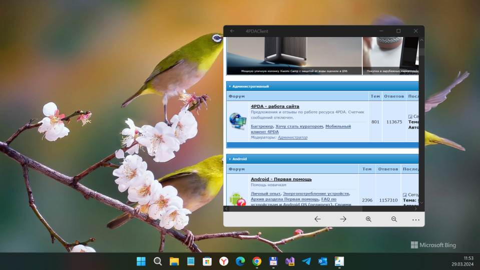
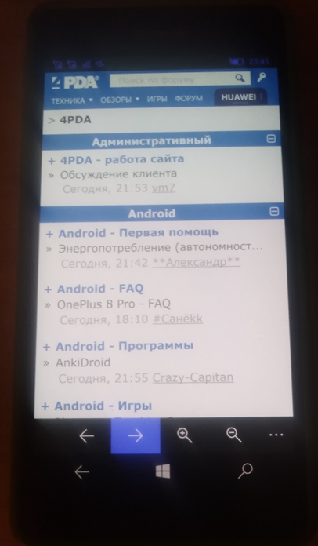

# 4PDAClient v1.0.0.35 (v1.0-alpha)
My attempt to recover discontinued [4PDAClient app](https://www.microsoft.com/ru-ru/p/4pdaclient/9nblggh0ggvj).

## About
Simple UWP application to display 4PDA web site on "winphone" with Windows 10 Mobile.

## Screenshots

## Tech/dev details
- Platforms: UWP only
- Targets: ARM
- OSes: Windows 10 Mobile (os build: 10240 or above)

## Status
- Draft. Prototype / Alpha version.
- "Web parsing" not realized yet ... so, no push notifications, etc.
- "Astoria" compatibility added (os build 10240).
- News/Forum mode switch added.

## Credits / Thanks
- [jetspiking](https://github.com/jetspiking) for very 
  handy & useful [WebWhatsApp](https://github.com/jetspiking/WindowsPhone_WebWhatsApp) repo!

## Licensing
MIT License

## ..
AS IS. No support. RnD only / DIY

## .
[m][e] 2024
