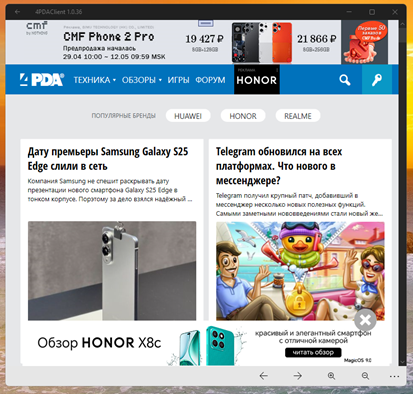
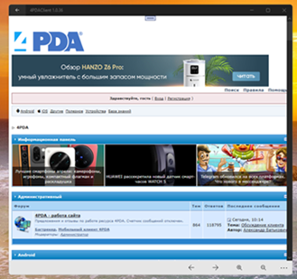
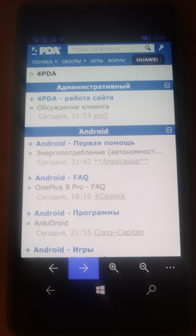

# 4PDAClient v1.0.36 - main branch

## About
Simple UWP application to display 4PDA web site on your od sweey winphone(s) with disconinue Mirosoft Windows 10 Mobile os... =)

## Description
The simplest mobile application for interacting with the legendary 4PDA website. It is essentially a wrapper to 4pda.to .
For a successful installation, simply download the attached 4PDAClient_1.0_36_ARM.appx and install it on your winphone.

## Features
- In the forum reading mode (Forum section), you can change the font size by clicking on the "+" or "-" buttons.
- Shows small advertising banners in the news display mode (Home page), to the delight of the creators of 4PDA!
- Does not require the use of site "anti-blocking things", because it is a regular "web-view".
- Automatically updates the design if the developers (designers) of 4PDA suddenly change the layout)
- When restarting the program, the font size should be saved.
- Suitable even for W10 older versions starting with build number 10240 :)

## Screenshots

## Tech/dev details
- Platforms: UWP only
- Targets: ARM
- OSes: Windows 10 Mobile (os build: 10240 or above)

## Status
- Draft. Prototype / Alpha version.
- "Web parsing" not realized yet ... so, no push notifications, etc.
- "Astoria" compatibility added (os build 10240).
- News/Forum mode switch added.

## Credits / Thanks
- [jetspiking](https://github.com/jetspiking) for very 
  handy & useful [WebWhatsApp](https://github.com/jetspiking/WindowsPhone_WebWhatsApp) repo!

## Licensing
MIT License

## ..
AS IS. No support. RnD only / DIY

## .
[m][e] May, 1 2025
