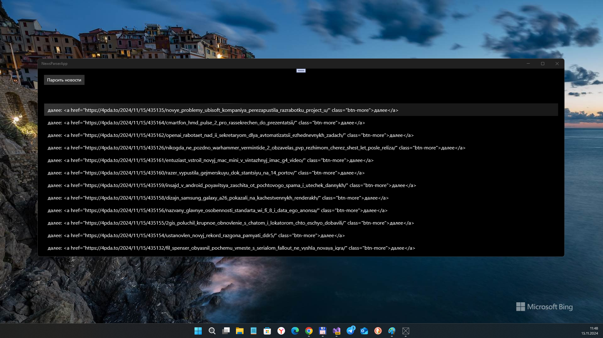
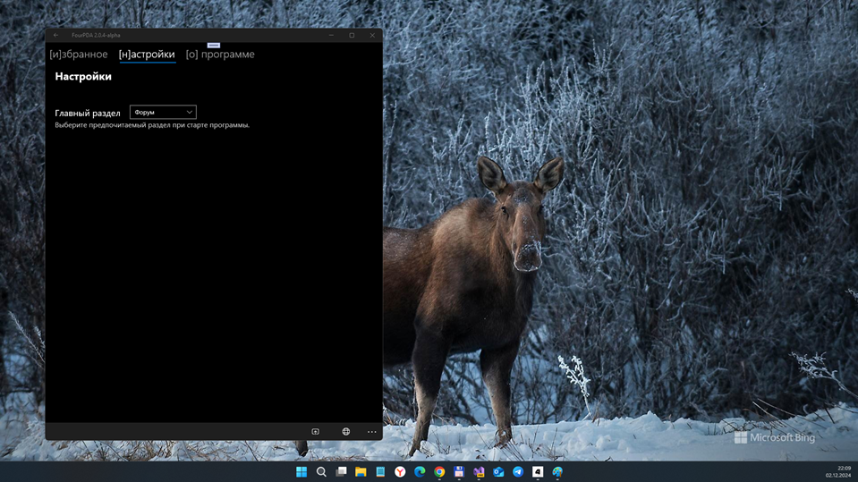

# 4PDAClient v2.0.0 (FourPDA codename) - newsparser branch

## About
I have some plans to "recover" 4PDA-for-W10M. :) 

My attempt to remake fully discontinued & obsolete [ForPDA](https://4pda.to/forum/index.php?showtopic=478458#entry23314163) for WP7 app. 

## About
Very early bird; draft UWP application to "parse" 4PDA web site on some winphone with Windows 10 Mobile os...

## Screenshots

## Tech/dev details
- Platforms: UWP only
- Targets: x64; ARM
- OSes: Windows 10 (Mobile) ; build: 10240 or above

## Status
- Special *newsparser* branch created for some "site-scraping" experiments :)
- Normal News "web parsing" not realized yet.

## Licensing
MIT License

## ..
AS IS. No support. RnD only / DIY

## .
[m][e] November 2024
