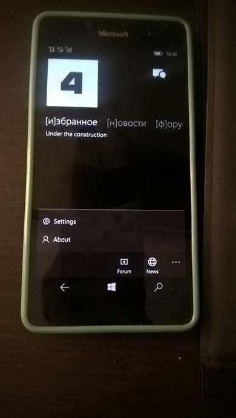
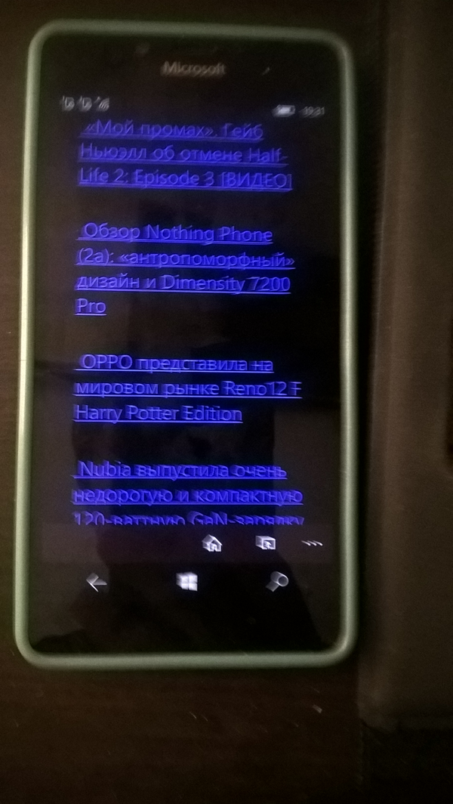
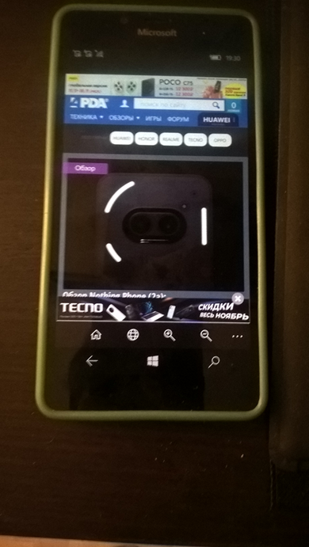
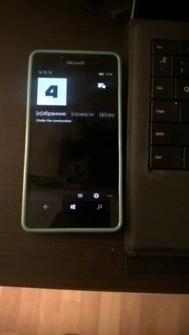

# 4PDAClient v2.0.2 (FourPDA codename) - dev branch

## About
I have some plans to "recover" 4PDA-for-W10M. :)

My attempt to remake fully discontinued & obsolete [ForPDA](https://4pda.to/forum/index.php?showtopic=478458#entry23314163) for WP7 app. 

## About
Very early bird; draft UWP application to "parse" 4PDA web site on some winphone with Windows 10 Mobile os...

## Screenshots
 
 

## Tech/dev details
- Platforms: UWP only
- Targets: x64; ARM
- OSes: Windows 10 (Mobile); 
- Min. Win. OS build: 10240 (Hello, project Astoria!)

## Status / my 2 cents
- ForPDA decomp. completed but over 100500 bugs there!
- Draft. Prototype / Pre-Pre-Pre-Alpha version. Still exploring Caliburn.Micro "magic"...
- News / Forum "web parsing" not realized yet (only news feed is really parsed into News list!)

## Licensing
MIT License

## ..
AS IS. No support. RnD only / DIY

## .
[m][e] November 2024
